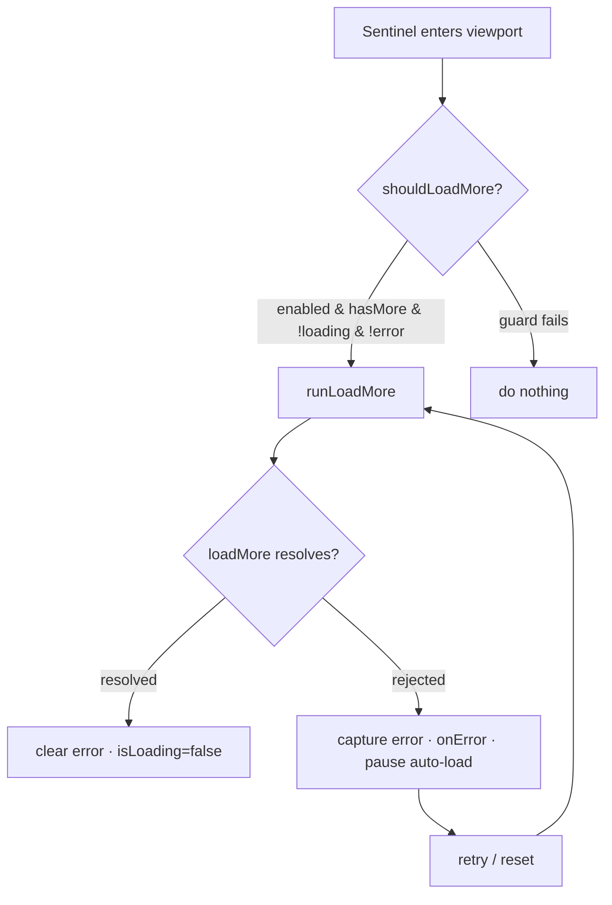

<div align="center">
  

  <h1>react-infinite-scroll</h1>

  <p><strong>A tiny, strict-typed infinite-scroll hook & component for React — feeds, chat, error recovery, and scroll restoration, all on the native IntersectionObserver.</strong></p>

  <p><em>Built and maintained by Viprasol Tech</em></p>

  <p>
    <a href="https://github.com/Viprasol-Tech/react-infinite-scroll/actions"></a>
    <a href="LICENSE"></a>
    <a href="https://www.npmjs.com/package/react-infinite-scroll"></a>
    <a href="https://www.typescriptlang.org/"></a>
    <a href="#"></a>
    <a href="#"></a>
    <a href="https://reactjs.org/">=18" /></a>
  </p>
</div>

---

## ✨ Features

- 🪝 **`useInfiniteScroll` hook** powered by the native `IntersectionObserver` — no scroll listeners, no throttling math.
- 📜 **`<InfiniteList>` component** for the common "render items + sentinel + loader" pattern, batteries included.
- 💬 **Chat / reverse mode** (`direction="up"`) — sentinel at the top, older messages prepended, viewport kept perfectly still.
- 🧷 **Scroll restoration** — `useScrollRestoration` preserves the user's position across prepends, with optional "stick to bottom".
- 🔁 **Error + retry built in** — a rejecting `loadMore` is caught, auto-loading pauses, and you get `error` / `retry()` / `reset()` plus an accessible default Retry UI.
- 🛡️ **Re-entrancy safe** — `loadMore` is never called twice concurrently, nor while `hasMore` is `false`, the hook is disabled, or an error is outstanding.
- ♿ **Accessible** — `role="feed"`, `aria-busy`, `aria-label`, polite live region for the loader, `role="alert"` for errors.
- 🧪 **Pure, exported helpers** (`shouldLoadMore`, `isAtBottom`, `isAtTop`, …) so the load guard and scroll math are fully testable.
- 🧬 **Fully typed & generic** over your item type, written in strict TypeScript with **zero runtime dependencies**.

## 📦 Install

```bash
npm i react-infinite-scroll
# or
pnpm add react-infinite-scroll
# or
yarn add react-infinite-scroll
```

`react` and `react-dom` (>=18) are peer dependencies.

## 🚀 Usage

### Classic feed (scroll down)

```tsx
import { useState, useCallback } from "react";
import { InfiniteList } from "react-infinite-scroll";

export function Feed() {
  const [items, setItems] = useState<number[]>([0, 1, 2]);
  const [hasMore, setHasMore] = useState(true);

  const loadMore = useCallback(async () => {
    const next = await fetchPage(items.length);
    setItems((prev) => [...prev, ...next.items]);
    setHasMore(next.hasMore);
  }, [items.length]);

  return (
    <InfiniteList
      items={items}
      hasMore={hasMore}
      loadMore={loadMore}
      renderItem={(n) => <div className="row">Row #{n}</div>}
      loader={<p>Loading more…</p>}
      endMessage={<p>You have reached the end.</p>}
      rootMargin={200}
      aria-label="Activity feed"
    />
  );
}
```

### Chat / reverse mode (load older messages on scroll up)

```tsx
import { InfiniteList } from "react-infinite-scroll";

export function ChatWindow({ messages, hasMore, loadOlder }: Props) {
  return (
    <InfiniteList
      items={messages}
      hasMore={hasMore}
      loadMore={loadOlder}
      direction="up"            // sentinel at top, older items prepended
      stickToBottom             // keep newest in view when you're at the bottom
      getKey={(m) => m.id}
      renderItem={(m) => <Bubble message={m} />}
      loader={<p>Loading history…</p>}
      style={{ height: 480, overflowY: "auto" }}
    />
  );
}
```

### Errors with a custom retry UI

```tsx
<InfiniteList
  items={items}
  hasMore={hasMore}
  loadMore={loadMore}
  renderItem={(it) => <Card {...it} />}
  onError={(err) => console.error(err)}
  renderError={(error, retry) => (
    <div role="alert">
      Couldn’t load more: {error.message}
      <button onClick={retry}>Try again</button>
    </div>
  )}
/>
```

### Just the hook (bring your own markup)

```tsx
import { useInfiniteScroll } from "react-infinite-scroll";

function List({ items, hasMore, loadMore }: Props) {
  const { sentinelRef, isLoading, error, retry } = useInfiniteScroll({
    loadMore,
    hasMore,
  });

  return (
    <ul>
      {items.map((it) => (
        <li key={it.id}>{it.label}</li>
      ))}
      {hasMore && !error && <li ref={sentinelRef} aria-hidden />}
      {isLoading && <li>Loading…</li>}
      {error && <li role="alert">{error.message} <button onClick={retry}>Retry</button></li>}
    </ul>
  );
}
```

## 🧩 How it works



## 📚 API

### `useInfiniteScroll(options)`

| Option       | Type                                  | Default   | Description                                                  |
| ------------ | ------------------------------------- | --------- | ------------------------------------------------------------ |
| `loadMore`   | `() => void \| Promise<void>`         | —         | Called when the sentinel becomes visible and loading is OK.  |
| `hasMore`    | `boolean`                             | —         | Whether more pages exist. When `false`, never loads.         |
| `enabled`    | `boolean`                             | `true`    | Disable the observer without unmounting.                     |
| `direction`  | `"down" \| "up"`                      | `"down"`  | Append direction; `"up"` is the chat pattern.                |
| `root`       | `Element \| Document \| null`         | `null`    | The scroll root; defaults to the viewport.                   |
| `rootMargin` | `string \| number`                    | `"0px"`   | Margin around the root (number = px on every edge).          |
| `threshold`  | `number \| number[]`                  | `0`       | Visibility ratio(s) that trigger a load.                     |
| `onError`    | `(error: Error) => void`              | —         | Called when `loadMore` rejects (error is normalized).        |

**Returns** `{ sentinelRef, isLoading, error, retry, reset, direction }`.

| Returned     | Type                       | Description                                                          |
| ------------ | -------------------------- | ------------------------------------------------------------------- |
| `sentinelRef`| `(node: T \| null) => void`| Attach to an element at the end (or top) of your list.             |
| `isLoading`  | `boolean`                  | True while a `loadMore` call is in flight.                          |
| `error`      | `Error \| null`            | Last failed load; while set, auto-loading is paused.               |
| `retry`      | `() => void`               | Clear the error and re-attempt `loadMore`.                          |
| `reset`      | `() => void`               | Clear the error without loading.                                    |
| `direction`  | `"down" \| "up"`           | The resolved scroll direction.                                      |

### `<InfiniteList>`

Accepts every hook option above (except `root`) plus:

| Prop                     | Type                                        | Default            | Description                                              |
| ------------------------ | ------------------------------------------- | ------------------ | ------------------------------------------------------- |
| `items`                  | `T[]`                                        | —                  | The items to render.                                    |
| `renderItem`             | `(item, index) => ReactNode`                 | —                  | Render a single item.                                   |
| `getKey`                 | `(item, index) => Key`                       | array index        | Stable React key for an item.                           |
| `maintainScrollPosition` | `boolean`                                    | `true` if reverse  | Restore scroll position on prepend.                     |
| `stickToBottom`          | `boolean`                                    | `false`            | Stay pinned to the bottom in reverse mode.              |
| `loader`                 | `ReactNode`                                  | —                  | Shown while loading.                                    |
| `endMessage`             | `ReactNode`                                  | —                  | Shown once `hasMore` is `false`.                        |
| `renderError`            | `ReactNode \| (error, retry) => ReactNode`   | default Retry UI   | Error UI; render-prop receives `(error, retry)`.        |
| `aria-label`             | `string`                                     | —                  | Accessible label for the feed region.                   |
| `className` / `style`    | `string` / `CSSProperties`                   | —                  | Applied to the outer scroll container.                  |

### `useScrollRestoration(options)`

Preserve a scroll container's visual position across content changes. Attach the returned `containerRef` to your scrollable element; call `capture()` just before fetching to snapshot the position.

| Option            | Type      | Default | Description                                              |
| ----------------- | --------- | ------- | ------------------------------------------------------- |
| `prependKey`      | `unknown` | —       | Changes when items are prepended (e.g. `items.length`). |
| `enabled`         | `boolean` | `true`  | Enable restoration on prepend.                          |
| `stickToBottom`   | `boolean` | `false` | Keep the user pinned to the bottom if they were there.  |
| `bottomTolerance` | `number`  | `8`     | Pixel tolerance for the bottom-pinned check.            |

### Pure helpers

| Helper                                        | Description                                                                 |
| --------------------------------------------- | -------------------------------------------------------------------------- |
| `shouldLoadMore(state)`                       | `true` only when `enabled && isIntersecting && hasMore && !isLoading && !hasError`. |
| `normalizeRootMargin(margin)`                 | Number → 4-edge CSS string; string passes through.                         |
| `buildObserverInit(opts)`                     | Build a normalized `IntersectionObserverInit`.                             |
| `latestEntry(entries)`                        | The freshest entry from an observer batch.                                 |
| `toError(value)`                              | Normalize any thrown value into a real `Error`.                            |
| `captureScroll(el)`                           | Snapshot `{ scrollTop, scrollHeight }`.                                    |
| `restoreScrollTopAfterPrepend(prev, newH)`    | The `scrollTop` that preserves position after a prepend.                   |
| `isAtBottom(el, tol?)` / `isAtTop(el, tol?)`  | Edge-proximity checks for chat sticking and "load older" triggers.        |

## 🗺️ Roadmap

- [x] IntersectionObserver-based hook & component
- [x] Reverse / chat mode with scroll restoration
- [x] Error capture + retry/reset lifecycle
- [x] Accessibility (`role="feed"`, `aria-busy`, live regions)
- [ ] Optional virtualization adapter for very long lists
- [ ] `useInView` standalone primitive export
- [ ] Built-in `IntersectionObserver` polyfill toggle for legacy targets

## ❓ FAQ

**Why IntersectionObserver instead of scroll events?**
It's the platform-native, throttle-free way to know when an element is near the viewport — less code, fewer bugs, better performance.

**Does it work in chat apps where you scroll up?**
Yes. Set `direction="up"` and the sentinel sits at the top; `useScrollRestoration` keeps the viewport stable as older messages are prepended.

**What happens when `loadMore` throws?**
The error is captured, auto-loading pauses (so you don't hammer a failing endpoint), and you get `error` + `retry()`. `<InfiniteList>` shows an accessible default Retry button, or your own via `renderError`.

**How do I test components that use this in jsdom?**
`IntersectionObserver` isn't implemented in jsdom — stub it with a controllable mock. See `src/__tests__/InfiniteList.test.tsx` for a complete, copy-pasteable example.

## 🤝 Contributing

Contributions are welcome! Please read [CONTRIBUTING.md](CONTRIBUTING.md) and our [Code of Conduct](CODE_OF_CONDUCT.md) before opening a pull request. Run `npm install`, then `npm run typecheck` and `npm test` before submitting.

## Contact — Viprasol Tech Private Limited

- Website: [viprasol.com](https://viprasol.com)
- Email: [support@viprasol.com](mailto:support@viprasol.com)
- Telegram: [t.me/viprasol_help](https://t.me/viprasol_help) | WhatsApp: +91 96336 52112
- GitHub: [@Viprasol-Tech](https://github.com/Viprasol-Tech) | [LinkedIn](https://www.linkedin.com/in/viprasol/) | X [@viprasol](https://twitter.com/viprasol)

## License

[MIT](LICENSE) (c) 2025 Viprasol Tech Private Limited
